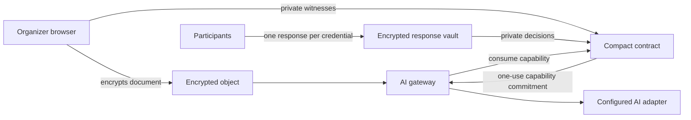

# Architecture

## Components

The browser and gateway keep plaintext and witness values off the public ledger. Compact publishes commitments and lifecycle transitions that a verifier can inspect without learning the underlying consent record.

## Contract state machine

| Status | Meaning | Allowed transition |
| --- | --- | --- |
| `0` | No request | Create → `1` |
| `1` | Awaiting private consent | Issue → `2`; revoke → `3` |
| `2` | Capability issued | Consume → `4`; revoke → `3` |
| `3` | Revoked | Create a new request → `1` |
| `4` | Consumed | Create a new request → `1` |

`issueCapability` recomputes the full private request commitment, verifies unique credentials and binary decisions, checks that approvals meet the hidden threshold, rejects an expired request, and publishes a response nullifier plus capability commitment. `consumeCapability` recomputes the capability from the committed request, content, purpose, and secret, then moves the contract to the terminal consumed state.

## Purpose binding

The MVP hashes one canonical purpose string containing:

- AI task
- model identifier
- allowed recipient class
- retention period

Changing any field changes the purpose hash and invalidates the capability. Integrators should replace the demonstration string format with a versioned canonical schema before production use.

## Threat model

The MVP protects against public disclosure of participant identities, decisions, threshold, purpose, and content; capability reuse; using a capability for different content or purpose; duplicate participant credentials; unauthorized revocation; and processing before authorization.

It assumes the organizer distributed the committed credentials to the intended participants, the response vault and gateway protect their local keys, and the AI adapter receives plaintext only after successful consumption. Network-attested time remains a production requirement, as documented in the README.

## MVP trust assumptions

The Level 4 browser flow demonstrates the generated Compact circuits and privacy lifecycle in one client. It does not yet separate the organizer, participants, gateway, and key custodian into independent security domains. In particular:

- The organizer-facing demo supplies all participant witnesses. Production participants must sign the request commitment independently, with those signatures verified inside the proof.
- The sample document key exists in the browser. Production ciphertext belongs in object storage and its key belongs in KMS or an HSM.
- The sample gateway consumes local generated-contract state. Production processing must wait for finalized Preprod state and atomically consume the capability before requesting key release.
- Expiry currently uses a public caller-supplied timestamp. Production expiry requires ledger-attested time.

These are explicit boundaries of the MVP rather than properties claimed by it. The contract lifecycle, commitment scheme, encrypted storage, deployment path, and rejection tests are the foundation for the separated architecture.
