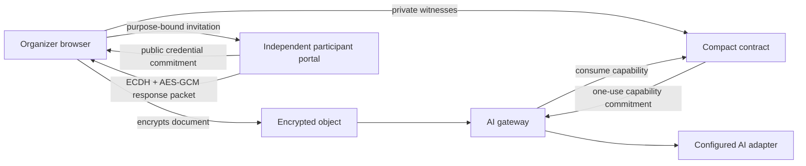

# Architecture

## Components

The browser and gateway keep plaintext and witness values off the public ledger. Compact publishes commitments and lifecycle transitions that a verifier can inspect without learning the underlying consent record.

## Contract state machine

| Status | Meaning | Allowed transition |
| --- | --- | --- |
| `0` | No request | Create → `1` |
| `1` | Awaiting private consent | Issue → `2`; organizer revoke or participant withdrawal → `3` |
| `2` | Capability issued | Consume → `4`; organizer revoke or participant withdrawal → `3` |
| `3` | Revoked | Create a new request → `1` |
| `4` | Consumed | Create a new request → `1` |

`createRequest` publishes three random credential commitments, rejects duplicates, and permanently registers each credential as used. `issueCapability` recomputes the full private request commitment, verifies binary decisions, checks that approvals meet the hidden threshold, rejects an expired request, and publishes a response nullifier plus capability commitment. `consumeCapability` recomputes the capability from the committed request, content, purpose, and secret, then moves the contract to the terminal consumed state. `withdrawConsent` accepts a private participant revocation preimage matching one of the three public random handles and revokes the request without the organizer secret.

## Purpose binding

The MVP hashes a versioned canonical JSON policy containing:

- AI task
- model identifier
- allowed recipient class
- retention period

Changing any field changes the purpose hash and invalidates the capability. Before decryption, the gateway checks the configured task, model, and recipient exactly and rejects retention longer than the committed maximum.

## Threat model

The MVP protects against public disclosure of participant legal identity, credential preimages, decisions, threshold, purpose, and content; invitation tampering when the organizer fingerprint is verified; converting a decline into an approval; credential reuse across requests; capability reuse; using a capability for different content or purpose; duplicate participant credentials; unauthorized revocation; and processing before authorization.

Enrollment credentials are pseudonymous. VeilConsent assumes the organizer and participant compare credential and organizer fingerprints through an authenticated channel. Establishing that a credential belongs to a particular legal person requires an external wallet, identity provider, or verifiable credential issuer. The response vault and gateway must protect their local keys, and the AI adapter receives plaintext only after successful consumption. Expiry is checked against Midnight block time.

## Independent participant handoff

The hosted MVP includes an organizer workspace and a separate participant portal. The transport is intentionally provider-neutral and works with copyable packets:

1. A participant creates separate random approval and withdrawal secrets. The enrollment packet contains only their Compact commitments.
2. The organizer validates each credential fingerprint with the intended participant, commits three approval credentials and withdrawal handles, and generates fresh P-256 encryption and signing keys for that request.
3. Each invitation includes the participant slot, credential commitment, public request commitment, exact purpose terms, expiry, organizer encryption key, and organizer signing key. The participant verifies its signature and compares the signing-key fingerprint through a separate trusted channel.
4. The participant verifies the terms and encrypts their decision using ephemeral P-256 ECDH, HKDF-SHA-256, and AES-256-GCM. An approval includes the one-time credential preimage needed by the Compact circuit; a decline never releases that approval material. The public request commitment is authenticated as additional data.
5. The organizer decrypts the packet locally, checks its request binding, verifies approval material against the enrolled credential when present, rejects duplicate responses, and supplies the decision as a private Compact witness. Changing a decline to an approval fails because the organizer never receives a valid approval witness.

An approval preimage is disclosed to the organizer proving the transaction, but it is never included in the enrollment packet, a declined response, or public chain state. Compact binds it to the enrolled credential and publishes a one-time nullifier, so it cannot authorize a later request. The independent revocation preimage remains participant-held and can revoke an awaiting or issued capability through `withdrawConsent`.

## MVP trust assumptions

The Level 4 browser flow now separates participant credential generation and response encryption from the organizer workspace. It does not yet separate the organizer, gateway, and key custodian into independent security domains. In particular:

- The local walkthrough still generates sample credentials in one organizer-controlled client for a short reviewer path. The independent workflow uses the participant portal and encrypted packets described above.
- The sample document key exists in the browser. Production ciphertext belongs in object storage and its key belongs in KMS or an HSM.
- The sample gateway consumes local generated-contract state. Production processing must wait for finalized Preprod state and atomically consume the capability before requesting key release.

These are explicit boundaries of the MVP rather than properties claimed by it. The contract lifecycle, commitment scheme, encrypted storage, deployment path, and rejection tests are the foundation for the separated architecture.
