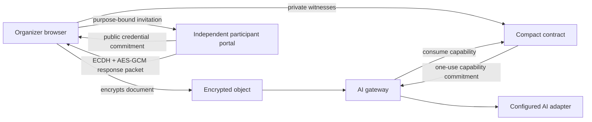

# Architecture

## Components

The browser and gateway keep plaintext and witness values off the public ledger. Compact publishes commitments and lifecycle transitions that a verifier can inspect without learning the underlying consent record.

## Contract state machine

| Status | Meaning | Allowed transition |
| --- | --- | --- |
| `0` | No request | Create → `1` |
| `1` | Awaiting private consent | Issue → `2`; revoke → `3` |
| `2` | Capability issued | Consume → `4`; revoke → `3` |
| `3` | Revoked | Create a new request → `1` |
| `4` | Consumed | Create a new request → `1` |

`issueCapability` recomputes the full private request commitment, verifies unique credentials and binary decisions, checks that approvals meet the hidden threshold, rejects an expired request, and publishes a response nullifier plus capability commitment. `consumeCapability` recomputes the capability from the committed request, content, purpose, and secret, then moves the contract to the terminal consumed state.

## Purpose binding

The MVP hashes one canonical purpose string containing:

- AI task
- model identifier
- allowed recipient class
- retention period

Changing any field changes the purpose hash and invalidates the capability. Integrators should replace the demonstration string format with a versioned canonical schema before production use.

## Threat model

The MVP protects against public disclosure of participant identities, decisions, threshold, purpose, and content; capability reuse; using a capability for different content or purpose; duplicate participant credentials; unauthorized revocation; and processing before authorization.

It assumes the organizer distributed the committed credentials to the intended participants, the response vault and gateway protect their local keys, and the AI adapter receives plaintext only after successful consumption. Expiry is checked against Midnight block time.

## Independent participant handoff

The hosted MVP includes an organizer workspace and a separate participant portal. The transport is intentionally provider-neutral and works with copyable packets:

1. A participant creates a random one-time secret in the participant portal and sends only its Compact credential commitment to the organizer.
2. The organizer commits three credentials when creating the request and generates a fresh P-256 ECDH key pair for that request.
3. Each invitation includes the participant slot, credential commitment, public request commitment, exact purpose terms, expiry, and organizer public encryption key.
4. The participant verifies the terms and encrypts their decision and credential preimage using ephemeral ECDH and AES-GCM. The public request commitment is authenticated as additional data.
5. The organizer decrypts the packet locally, checks its request binding, derives and verifies the enrolled credential, rejects duplicate responses, and supplies the decision as a private Compact witness.

The response preimage is disclosed to the organizer proving the transaction, but it is never included in the enrollment packet or published on-chain. Compact binds it to the enrolled credential and publishes a request-domain nullifier, so it cannot authorize a later request.

## MVP trust assumptions

The Level 4 browser flow now separates participant credential generation and response encryption from the organizer workspace. It does not yet separate the organizer, gateway, and key custodian into independent security domains. In particular:

- The local walkthrough still generates sample credentials in one organizer-controlled client for a short reviewer path. The independent workflow uses the participant portal and encrypted packets described above.
- The sample document key exists in the browser. Production ciphertext belongs in object storage and its key belongs in KMS or an HSM.
- The sample gateway consumes local generated-contract state. Production processing must wait for finalized Preprod state and atomically consume the capability before requesting key release.

These are explicit boundaries of the MVP rather than properties claimed by it. The contract lifecycle, commitment scheme, encrypted storage, deployment path, and rejection tests are the foundation for the separated architecture.
