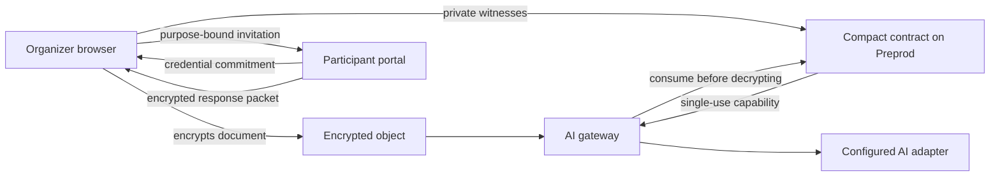

# VeilConsent

[](https://github.com/daveaire/veil-consent/actions/workflows/ci.yml)

> Private multi-party consent for purpose-bound AI processing.


## Live Demo

[Open the live VeilConsent demo](https://daveaire.github.io/veil-consent/). The same interface runs locally with `npm run dashboard`.

[Watch the narrated, captioned product walkthrough](https://daveaire.github.io/veil-consent/veil-consent-mvp.mp4).

## Contract Address

| Network | Address |
| --- | --- |
| Preprod | [`6f995e8986feb2b107a7e65e650413ef150fe63bf88285a88c3da4c505d5ddcd`](https://preprod.midnightexplorer.com/contracts/0x6f995e8986feb2b107a7e65e650413ef150fe63bf88285a88c3da4c505d5ddcd) |

The deployed contract completed a full request lifecycle on Preprod at block `2702471`:

- Create: `0098474fb0848b2f588dd8948046e19dcc9a60df049ac695c1248f99209340392f`
- Issue: `004ba33bc440313d1964cc88690667ce9644f085c6918b5e81f5d905f58cf5f410`
- Consume: `00676d839696328a906c1375c1e22e0502eb65f15850232d04950645b9d3f3779f`

The final request state is consumed. Participant identity, individual decision, threshold, purpose, and document data were not published. See the [Preprod deployment record](docs/PREPROD.md) for the commitments and validation method.

Verify the current public state directly against the Preprod indexer:

```sh
npm run network:verify -- --network preprod
```

## What This Product Does

VeilConsent prevents its AI gateway from processing shared private material until enough enrolled pseudonymous credentials provide valid approval witnesses for one exact use. A request binds an encrypted document to a canonical task, model, recipient class, retention term, consent policy, and expiry. Real-world identity assurance is supplied by an external wallet or credential issuer.

Participants create separate approval and withdrawal credentials in a separate portal and return ECDH-encrypted, request-bound response packets. Organizer invitations are signed and verified against an out-of-band fingerprint. A Compact circuit proves that the private consent rule passed and issues a single-use capability. Participants can revoke with their independent withdrawal secret. The gateway validates the committed execution policy and consumes the capability before decrypting the document; the public lifecycle then blocks replay.

Midnight is used because the authorization decision must be verifiable without publishing participant identities, individual decisions, or the threshold. A conventional public contract would reveal the very consent record VeilConsent is designed to protect.

**Vision:** make consent a machine-verifiable prerequisite for sensitive AI workflows, while keeping the consent record private by default.

**Key features:** private threshold and unanimous policies, independent participant enrollment, signed organizer invitations, decline-safe responses, participant withdrawal credentials, encrypted response handoff, local document encryption, executable purpose policies, expiry, replay prevention, compatible Midnight wallet selection, and a small consent-gated AI adapter.



## Privacy Model

**Public on-chain**

- Request and capability commitments
- Expiry and lifecycle status
- Aggregate request, issue, consumption, and revocation counters
- A response nullifier that prevents reuse
- One-time pseudonymous participant credential commitments
- Random pseudonymous participant revocation handles

**Private witness or local data**

- Document, encryption key, and exact processing purpose
- Participant legal identities, credential preimages, and individual decisions
- Consent threshold, organizer secret, and capability secret

**Proved without revealing**

- The committed policy has enough valid approvals
- The request has not expired or been revoked
- The capability matches the committed content and purpose
- The same responses and capability cannot be reused

Expiry is enforced with Compact's `blockTimeLte` predicate, so Preprod evaluates the deadline against the block that includes the transaction.

## Tech Stack

- Compact language 0.23 and toolchain 0.31.1
- Midnight.js 4.1.1 and Compact runtime 0.16.0
- Midnight proof server 8.1.0
- Plain browser JavaScript bundled with esbuild
- Node.js test runner and GitHub Actions
- P-256 ECDH, HKDF-SHA-256, and AES-256-GCM for participant response encryption
- AES-256-GCM for local document encryption

## Prerequisites

- Node.js 22 or later and npm 10 or later
- A compatible Midnight wallet, such as Lace, configured for Preprod
- Compact toolchain 0.31.1
- Docker only for proof generation and Preprod deployment
- Python 3.10+ and Chrome or Chromium only when rebuilding the narrated video

## Setup & Run Locally

1. Install dependencies and build the browser bundle.

   ```sh
   npm ci
   npm run build
   ```

2. Start the local product interface.

   ```sh
   npm run dashboard
   ```

3. Open <http://127.0.0.1:4210>, create a request, prove the sample consent policy, and process the encrypted document once. Choose **Independent participants** to test enrollment and encrypted response handoff across separate browser contexts.

4. To exercise the Preprod deployment workflow:

   ```sh
   npm run network:select -- preprod
   npm run network:address -- --network preprod
   npm run proof-server:start
   npm run compile
   npm run network:deploy -- --network preprod
   npm run network:prove -- --network preprod
   ```

Wallet recovery material, randomly generated consent witnesses, the private-state password, and private-state databases are owner-only and excluded from version control.

## Run Tests

```sh
npm run check
```

The suite covers threshold and unanimous policies, expiry, revocation, replay prevention, commitment binding, encrypted participant exchange, secure deployment-state persistence, and the one-use processing gateway. The command-line lifecycle is available through `npm run demo`.

## CI/CD

`.github/workflows/ci.yml` installs locked dependencies, compiles the Compact contract, runs the tests and dependency audit, and builds the browser interface on every push to `main` and every pull request. `.github/workflows/pages.yml` publishes the built demo to GitHub Pages. `.github/workflows/preprod.yml` queries and decodes the deployed contract every day and on demand.

Build the narrated reviewer video from the real interface with:

```sh
python3 -m pip install -r requirements-demo.txt
npm run demo:video
```

The renderer captures the real organizer and participant interfaces, generates the published narration, and writes the MP4 to `demo-output/veil-consent-mvp.mp4`. Each scene also includes an on-screen summary.

## Usage Guide

See [docs/USAGE.md](docs/USAGE.md).

## Product X Profile

[Follow VeilConsent on X](https://x.com/VeilConsent). Product copy and publishing notes are maintained in [PRODUCT-PROFILE.md](PRODUCT-PROFILE.md).

## Tester Feedback

After trying the MVP, use the [structured feedback form](https://github.com/daveaire/veil-consent/issues/new?template=feedback.yml). Do not include private documents, consent packets, wallet recovery material, or other sensitive data. Feedback decisions and implemented improvements are tracked in [feedback/README.md](feedback/README.md).

## Security Boundary

VeilConsent verifies whether an AI workflow is authorized to access committed data for a committed purpose at the time of each request. Revocation and expiry block future authorized access through the VeilConsent gateway. They cannot make previously disclosed information unread, erase copies retained by an agent or model provider, or control data after plaintext has left the gateway.

VeilConsent also cannot prove that an AI response is correct. See [ARCHITECTURE.md](ARCHITECTURE.md) for the protocol and threat model, [SECURITY.md](SECURITY.md) for the MVP trust assumptions, [docs/SECURITY-REVIEW.md](docs/SECURITY-REVIEW.md) for the finding register, and [DEMO.md](DEMO.md) for the reviewer walkthrough.

## License

Apache-2.0
