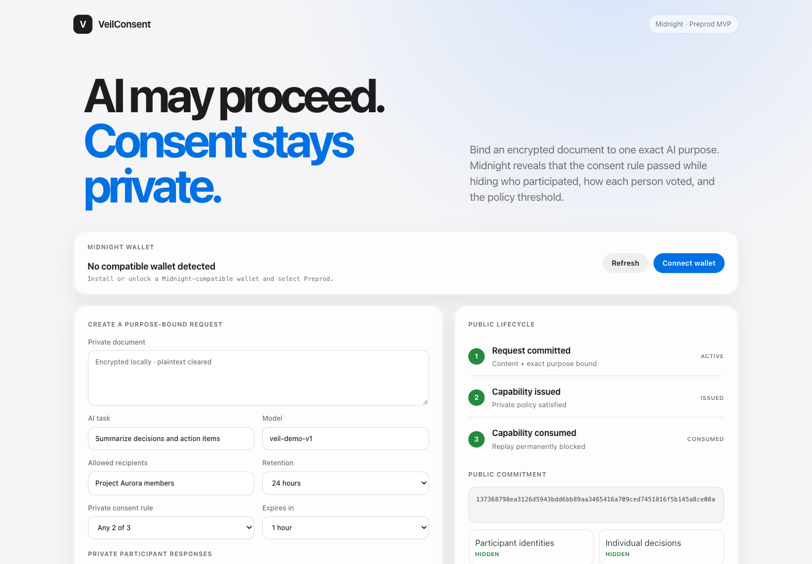
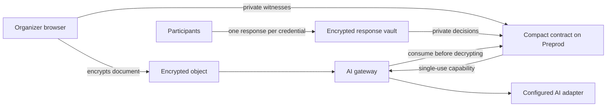

# VeilConsent

[](https://github.com/daveaire/veil-consent/actions/workflows/ci.yml)

> Private multi-party consent for purpose-bound AI processing.



## Live Demo

The public Preprod demo URL will be added after the first GitHub Pages deployment. The same interface runs locally with `npm run dashboard`.

## Contract Address

| Network | Address |
| --- | --- |
| Preprod | Deployment in progress |

## What This Product Does

VeilConsent prevents an AI gateway from processing shared private material until the people represented in that material have authorized one exact use. A request binds an encrypted document to a task, model, recipient class, retention term, consent policy, and expiry.

Participants respond with one-time credentials. A Compact circuit proves that the private consent rule passed and issues a single-use capability. The gateway consumes that capability before decrypting the document; the public lifecycle then blocks replay.

Midnight is used because the authorization decision must be verifiable without publishing participant identities, individual decisions, or the threshold. A conventional public contract would reveal the very consent record VeilConsent is designed to protect.

**Vision:** make consent a machine-verifiable prerequisite for sensitive AI workflows, while keeping the consent record private by default.

**Key features:** private threshold and unanimous policies, one-time participant credentials, local document encryption, purpose-bound capabilities, expiry, organizer revocation, replay prevention, compatible Midnight wallet selection, and a small consent-gated AI adapter.



## Privacy Model

**Public on-chain**

- Request and capability commitments
- Expiry and lifecycle status
- Aggregate request, issue, consumption, and revocation counters
- A response nullifier that prevents reuse

**Private witness or local data**

- Document, encryption key, and exact processing purpose
- Participant identities, credentials, and individual decisions
- Consent threshold, organizer secret, and capability secret

**Proved without revealing**

- The committed policy has enough valid approvals
- The request has not expired or been revoked
- The capability matches the committed content and purpose
- The same responses and capability cannot be reused

The MVP accepts `observedAt` as a public circuit input for expiry. A production release must bind that value to a network-attested time source before treating expiry as trustless.

## Tech Stack

- Compact language 0.23 and toolchain 0.31.1
- Midnight.js 4.1.1 and Compact runtime 0.16.0
- Midnight proof server 8.1.0
- Plain browser JavaScript bundled with esbuild
- Node.js test runner and GitHub Actions
- AES-256-GCM for local document and response encryption

## Prerequisites

- Node.js 22 or later and npm 10 or later
- A compatible Midnight wallet, such as Lace, configured for Preprod
- Compact toolchain 0.31.1
- Docker only for proof generation and Preprod deployment

## Setup & Run Locally

1. Install dependencies and build the browser bundle.

   ```sh
   npm ci
   npm run build
   ```

2. Start the local product interface.

   ```sh
   npm run dashboard
   ```

3. Open <http://127.0.0.1:4210>, create a request, prove the sample consent policy, and process the encrypted document once.

4. To exercise the Preprod deployment workflow:

   ```sh
   npm run network:select -- preprod
   npm run network:address -- --network preprod
   npm run proof-server:start
   npm run compile
   npm run network:deploy -- --network preprod
   npm run network:prove -- --network preprod
   ```

Wallet recovery material, the generated private-state password, and private-state databases are owner-only and excluded from version control.

## Run Tests

```sh
npm run check
```

The suite covers threshold and unanimous policies, expiry, revocation, replay prevention, commitment binding, encrypted response storage, and the one-use AI gateway. The command-line lifecycle is available through `npm run demo`.

## CI/CD

`.github/workflows/ci.yml` installs dependencies, compiles the Compact contract, runs the checks, and builds the browser interface on every push to `main` and every pull request. `.github/workflows/pages.yml` publishes the built demo to GitHub Pages.

Build the captioned 20-second reviewer video from the real interface with:

```sh
npm run demo:video
```

The silent MP4 is written to `demo-output/veil-consent-mvp.mp4`; all essential explanation is on screen.

## Usage Guide

See [docs/USAGE.md](docs/USAGE.md).

## Product X Profile

The public profile URL will be added after the product account is created. Launch copy is ready in [PRODUCT-PROFILE.md](PRODUCT-PROFILE.md).

## Security Boundary

VeilConsent proves authorization to process committed data for a committed purpose. It cannot prove that an AI response is correct, erase copies made outside the gateway, or control a model provider after plaintext has been released. See [ARCHITECTURE.md](ARCHITECTURE.md) for the protocol and threat model, [SECURITY.md](SECURITY.md) for the MVP trust assumptions, and [DEMO.md](DEMO.md) for the reviewer walkthrough.

## License

Apache-2.0
