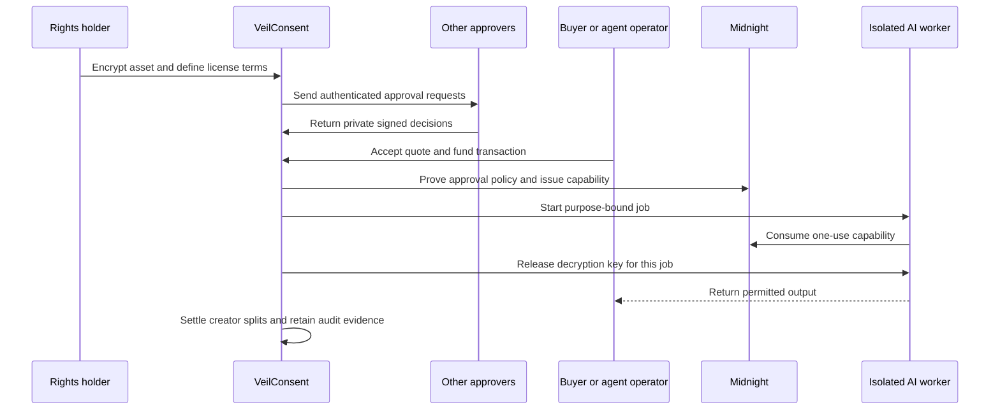
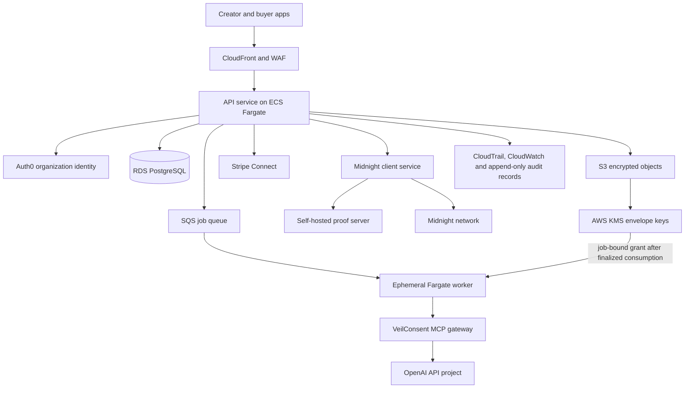

# VeilConsent production roadmap

**Status:** approved product direction; implementation begins after the Level 4 review is complete

**Document owner:** VeilConsent product and engineering

**Last reviewed:** 2026-09-28

**Scope:** creator licensing first; regulated health-data processing is a later enterprise track

This document is the source of truth for taking the current Preprod MVP into a real service. It records the product boundary, target architecture, required vendors and accounts, security and legal gates, delivery phases, and the implementation brief for future engineering work.

Do not put API keys, wallet seed phrases, passwords, participant packets, personal data, or account recovery material in this file, an issue, or the repository. Store production secrets in AWS Secrets Manager and wallet recovery material in an approved offline custody process.

## Product definition

VeilConsent is a private rights-clearance and payment layer that lets an AI agent purchase narrowly scoped computation over protected intellectual property without receiving unrestricted access to the underlying work.

The first commercial product serves creators, publishers, agencies, and AI application operators. A rights holder can register an encrypted work, define an allowed operation, collect the required approvals, quote a license, and permit one purpose-bound execution. The buyer receives the authorized result and evidence of the license. The raw work remains encrypted outside the controlled processing boundary.

The AI agent is not the legal customer. Its operator or organization is the licensee, payer, and accountable recipient. The agent acts with a delegated identity, budget, and tool permissions.

### Initial use case

A song has a composer, performer, and publisher. They authorize one model to create a private classification and licensing report for one named buyer, with no training or redistribution and a fixed retention period. Once the approval threshold and payment conditions are met, VeilConsent runs the task in an isolated worker, releases only the permitted output, records a one-use capability consumption, and distributes the proceeds according to the agreed split.

This is a better first market than hospital records. It has a clear payer, understandable rights, bounded outputs, and lower regulatory risk. Healthcare may later support hospital-controlled research queries over patient data. VeilConsent must never position that model as selling patient records.

### What the product proves

- The committed approval policy was satisfied at the time a capability was issued.
- The capability was bound to a content commitment, purpose, recipient, model policy, expiry, and license version.
- The gateway consumed a one-use capability before requesting decryption.
- The public evidence does not reveal the plaintext, individual decisions, or private threshold.

### What the product cannot guarantee

- Revocation cannot erase plaintext or outputs already disclosed or retained elsewhere.
- A proof of authorization does not prove that an AI output is correct or non-infringing.
- A wallet signature does not establish civil identity or ownership of intellectual-property rights.
- Blockchain state cannot enforce an external model provider's retention policy after disclosure.
- Encryption cannot prevent an authorized recipient from copying information it legitimately receives.

These limits must remain visible in the product, license, API documentation, and sales material.

## Customer workflow

The service must use compute-to-content: move approved computation to the protected object, not the protected object to the agent. Raw download is excluded from the first production release.

## License policy

Every authorization must bind a canonical, versioned policy containing at least:

| Field | Required meaning |
| --- | --- |
| Asset | Immutable content commitment, media type, size, and version |
| Rights assertion | Claimant organization, claimed rights, evidence reference, and verification status |
| Operation | Closed-list task identifier and constrained parameters |
| Model policy | Provider, model family or exact model, version rule, and prohibited fallbacks |
| Licensee | Authenticated legal organization and delegated service identity |
| Recipients | Named services and people allowed to receive the result |
| Output rights | Display, publication, commercial use, derivative use, and sublicensing terms |
| Training | Explicit allowed or prohibited value; prohibited by default |
| Territory and channel | Applicable geography and distribution channel |
| Retention | Maximum storage duration for inputs, outputs, and provider logs |
| Consent policy | Participant set, private threshold, expiry, and withdrawal rules |
| Economics | Quote, currency, platform fee, royalty splits, refund rules, and tax treatment |
| Execution | Maximum attempts, idempotency key, timeout, and output delivery policy |

Free-text purpose descriptions may accompany this policy, but enforcement must use validated identifiers and bounded parameters.

## Production architecture

Use one primary stack for the first release. AWS in an EU region is the recommended control plane, subject to customer residency requirements and legal review. Avoid a multi-cloud design until customer demand justifies it.

### Component responsibilities

| Component | Responsibility | Production rule |
| --- | --- | --- |
| Web application | Asset registration, policy creation, approvals, quote acceptance, and result access | No long-lived secrets; strict CSP; signed releases |
| API service | Authentication, policy validation, job orchestration, idempotency, and state projection | Private subnets; least-privilege service role |
| PostgreSQL | Organizations, users, policies, jobs, quotes, settlements, and audit indexes | Multi-AZ at launch; encrypted backups and tested restore |
| S3 | Ciphertext inputs and approved outputs | Block public access; versioning; lifecycle deletion; per-object encryption context |
| KMS | Wrap independent data-encryption keys | Key grants scoped to one job; no document key in contract witnesses |
| SQS | Durable job dispatch and retry control | Dead-letter queue; deduplication/idempotency where applicable |
| Fargate worker | Isolated, time-limited model execution | Fresh task per job; no inbound network; allowlisted egress; encrypted ephemeral storage |
| Midnight service | Submit and verify lifecycle transitions | Wait for configured finality; reconcile indexer state |
| Proof server | Generate proofs from private witnesses | Self-host because witness data is visible to this service; private network only |
| MCP gateway | Expose narrow agent tools and bind real execution metadata | Authenticate the operator and service account; never accept self-asserted provider metadata |
| Stripe Connect | Buyer payment, platform fee, seller onboarding, and payouts | Use test mode first; do not market the flow as escrow without legal approval |
| Observability | Operational metrics, traces, alerts, and security evidence | Redact plaintext, prompts, keys, packets, and personal data |

### Encryption and key release

The current MVP derives document encryption from `capabilitySecret`. Production must separate authorization secrets from encryption keys.

1. Generate a random data-encryption key for each object in the client or trusted ingestion service.
2. Encrypt the object with an authenticated cipher and a unique nonce.
3. Wrap the key with KMS using an encryption context containing organization, asset, policy, and object identifiers.
4. Store only ciphertext, the wrapped key, algorithm metadata, and commitments.
5. After finalized capability consumption, issue a short-lived KMS grant to one isolated worker identity.
6. Decrypt only into worker memory or encrypted ephemeral storage.
7. Destroy the task and revoke the grant after completion or failure.

For the highest-value content, evaluate AWS Nitro Enclaves after the normal isolated-worker design is operating. Enclaves are a later hardening step, not a prerequisite for the first creator pilot.

### Agent and Codex integration

Expose VeilConsent as a remote MCP server and retain a conventional REST API for non-agent clients. The first MCP tool surface should be:

- `quote_license`: returns terms and a quote without revealing protected content.
- `get_authorization_status`: returns public and requester-authorized lifecycle state.
- `run_authorized_task`: starts one idempotent job only after policy, payment, and capability checks.
- `get_job_result`: returns the licensed output and evidence bundle to an authorized recipient.
- `cancel_unstarted_job`: cancels a job before capability consumption and applies the refund rule.

Tool calls that commit funds or consume a capability require explicit operator authorization or a pre-approved budget policy. The MCP server must derive the buyer, provider, model, and recipient from authenticated infrastructure claims. It must not trust those values merely because the calling agent supplied them.

Use a dedicated OpenAI Platform project and service account with the smallest possible permissions and spend limits. Isolate every execution, restrict network access, and pass only the minimum input required by the license. OpenAI's Agents API documentation currently states that Agents API data residency is United States only and Zero Data Retention is not supported. Do not use that execution path for regulated health data or a customer requiring incompatible residency or retention terms unless written enterprise terms and current product controls resolve the conflict.

## Contract v2 requirements

The current contract deliberately supports one active three-person request. Production requires a new version rather than incremental assumptions around that state model.

- Address requests by immutable `requestId`; support concurrent requests and multiple tenants.
- Support a bounded or commitment-based participant set rather than exactly three fixed slots.
- Bind every response to request, policy version, participant credential, and expiry.
- Add recipient service identity, license version, payment reference commitment, and execution limits to the purpose commitment.
- Model distinct states for draft, awaiting approvals, authorized, funded, executing, completed, revoked, expired, failed, and refunded where on-chain evidence is necessary.
- Keep payment and consent transitions separate enough to audit and recover safely.
- Allow participant withdrawal through a wallet-backed transaction path.
- Define finality, retry, replay, and migration behavior before deployment.
- Version circuits and canonical encodings explicitly; publish migration and deprecation rules.
- Add sponsored transaction support only with rate limits and abuse controls.
- Complete an independent contract and cryptography review before Mainnet value is at risk.

Never copy production commitments into the existing deployment. Preserve the Level 4 contract as historical evidence and deploy v2 at a new address.

## Payments and monetization

The initial revenue model is:

- a platform fee on each completed license;
- paid creator and publisher plans for catalogs, approval workflows, analytics, and custom terms;
- enterprise API and MCP access;
- usage charges for protected storage and isolated compute;
- optional rights-verification and confidential split administration.

Fee percentages and subscription prices are hypotheses until interviews and pilot transactions validate willingness to pay.

Use this payment lifecycle:

1. Create an immutable quote with an expiry.
2. Authenticate the buying organization and its delegated agent.
3. Authorize or collect buyer funds under the reviewed payment design.
4. Issue and consume consent separately from payment processing.
5. Deliver the licensed result or apply the recorded failure/refund rule.
6. Settle platform fees and connected-account splits.
7. Retain receipts, evidence identifiers, and accounting records without storing protected content in payment metadata.

Stripe Connect can provide onboarding, platform fees, and payouts. It does not prove that a seller owns the claimed intellectual property. Do not call the product an escrow service unless counsel confirms the payment and licensing structure, jurisdictions, and money-transmission obligations.

## Identity and rights

Use organization accounts, MFA, role-based access, and auditable service accounts. Recommended roles are organization owner, rights administrator, approver, billing administrator, developer, auditor, and support operator.

Stripe identity and business onboarding supports payout eligibility; it is not a rights registry. The rights workflow must capture:

- the claimant and represented organization;
- the type and territory of claimed rights;
- supporting document references and verification status;
- co-owner and publisher approval requirements;
- a challenge and takedown path;
- warranty, indemnity, dispute, and refund terms approved by counsel.

Start with verified pilot partners and manual rights review. Add signed credentials or external rights registries only when a reliable issuer and customer need are known.

## Required accounts and infrastructure

Create accounts under a company-controlled email domain. Use a password manager, phishing-resistant MFA where available, at least two emergency administrators, separate development/staging/production environments, and billing alerts. Record account owner, recovery owner, renewal date, and data-processing agreement status in the company password manager or security register, never in Git.

| Service | Create | Cost model | What to configure | Official source |
| --- | --- | --- | --- | --- |
| GitHub organization | Now | Free or paid seats/features | Transfer or mirror repo, two admins, protected environments, Dependabot, secret scanning, private vulnerability reporting | [GitHub plans](https://github.com/pricing) |
| AWS organization and production account | Now | Pay as used | EU region, IAM Identity Center, MFA, budgets, CloudTrail, separate prod account | [Create AWS account](https://portal.aws.amazon.com/billing/signup), [calculator](https://calculator.aws/) |
| OpenAI Platform organization/project | Now for development | Usage billed | Dedicated project, service account, spend limit, key rotation, approved models, data-control review | [API platform](https://platform.openai.com/), [service accounts](https://developers.openai.com/api/reference/cli/resources/admin/subresources/organization/subresources/projects/subresources/service_accounts) |
| Auth0 tenant | Now | Free development tier; paid as use/features grow | Organizations, MFA, RBAC, machine-to-machine clients, custom domain before launch | [Sign up](https://auth0.com/signup), [pricing](https://auth0.com/pricing) |
| Stripe and Stripe Connect | Now in test mode | Transaction and Connect fees | Business verification, bank account, connected-account model, test webhooks, tax/legal review | [Create account](https://dashboard.stripe.com/register), [Connect](https://stripe.com/connect) |
| Midnight wallets and services | Keep Preprod now; Mainnet before paid launch | Network assets plus hosting | Separate deployer/operations wallets, NIGHT/DUST funding, self-hosted proof server, indexer monitoring | [environments](https://docs.midnight.network/relnotes/network), [deploy and operate](https://docs.midnight.network/guides/deploy-and-operate) |
| Sentry | Now | Free tier; paid by volume/features | Separate environments, source maps, alert routing, aggressive data scrubbing | [Create account](https://sentry.io/signup/) |
| Product domain and DNS | Now | Annual domain plus DNS usage | Company-owned registrar account, Route 53 zone, DNSSEC, ACM certificates | [Route 53 pricing](https://aws.amazon.com/route53/pricing/) |
| Transactional email | Before private pilot | Usage billed | SES domain verification, DKIM, DMARC, bounce/complaint handling | [SES pricing](https://aws.amazon.com/ses/pricing/) |
| Password manager | Now | Per-user subscription for business controls | Shared vaults, recovery policy, hardware-key MFA, audit logs | Select a business service through procurement |
| Legal counsel | Before accepting money or protected works | Professional fees | IP license, platform terms, privacy notice, DPA, Connect structure, disputes, consumer/tax review | Engage counsel in launch jurisdictions |
| Independent security review | Before production keys or paid pilot | Professional fees | Contract/circuit review, application penetration test, cloud/IAM review, remediation retest | Obtain at least two scoped proposals |
| Compliance automation | Later | Subscription | Evidence automation only after controls and customer requirements exist | Evaluate Vanta or Drata during enterprise sales |

### AWS service bill of materials

| Service | Purpose | Billing reference |
| --- | --- | --- |
| ECS on Fargate | API, Midnight client, proof service, and ephemeral workers | [Fargate pricing](https://aws.amazon.com/fargate/pricing/) |
| RDS for PostgreSQL | Durable transactional state | [RDS PostgreSQL pricing](https://aws.amazon.com/rds/postgresql/pricing/) |
| S3 | Encrypted assets, outputs, evidence, and backups | [S3 pricing](https://aws.amazon.com/s3/pricing/) |
| KMS | Key wrapping, job grants, and audit boundary | [KMS pricing](https://aws.amazon.com/kms/pricing/) |
| Secrets Manager | API credentials, database credentials, and webhook secrets | [Secrets Manager pricing](https://aws.amazon.com/secrets-manager/pricing/) |
| SQS | Durable job orchestration and dead-letter queues | [SQS pricing](https://aws.amazon.com/sqs/pricing/) |
| CloudWatch and CloudTrail | Metrics, logs, alerts, and control-plane audit | [CloudWatch pricing](https://aws.amazon.com/cloudwatch/pricing/), [CloudTrail pricing](https://aws.amazon.com/cloudtrail/pricing/) |
| CloudFront and WAF | TLS delivery, caching, and request filtering | [CloudFront pricing](https://aws.amazon.com/cloudfront/pricing/), [WAF pricing](https://aws.amazon.com/waf/pricing/) |

Account creation is usually free, but production usage, domains, professional services, transaction processing, audits, and network assets cost money. Build the first monthly estimate with the AWS Pricing Calculator after traffic, storage, proof-generation time, model choice, and availability targets are measured. Legal and security reviews should be budgeted separately because they often exceed early infrastructure spend.

## Secret and environment register

Store values in Secrets Manager or the relevant vendor's managed credential system. The table records names and ownership only.

| Secret class | Environment isolation | Rotation/event rule |
| --- | --- | --- |
| OpenAI service-account key | Separate project and key per environment | 90 days or immediately on role change/exposure |
| Stripe secret and webhook keys | Separate test/live credentials | On exposure; webhook secret when endpoint changes |
| Auth0 client secrets | Separate tenants or applications | 90 days or on exposure |
| Database credentials | Managed per environment | Automatic rotation where supported |
| KMS keys | Separate production keys and policies | Annual policy review; rotate key material per KMS policy |
| Midnight deployer/operations keys | Separate wallets and custody roles | Rotate operational keys on exposure; preserve documented recovery |
| Participant and organizer private state | Per user/request; never centralized without encryption | Delete according to policy and after terminal lifecycle when safe |

Development `.env` files remain local and ignored. Production services must fail closed if a required secret or environment identifier is missing. Never fall back from production to test credentials.

## Privacy, security, and operations gates

### Before a creator pilot

- Complete a data-flow diagram, threat model, and privacy impact review.
- Approve platform terms, creator license, privacy notice, DPA, dispute process, and payment terminology.
- Complete contract/circuit and application security reviews and close all critical/high findings.
- Demonstrate backup restoration, key-loss response, credential rotation, incident response, and customer deletion.
- Add abuse controls for illegal content, impersonation, rights fraud, sanctions, and payment disputes.
- Verify that logs, Sentry events, support tools, and payment metadata contain no protected content or secrets.
- Publish availability and support expectations; do not promise an unmeasured SLA.
- Run a small verified-partner pilot before self-service onboarding.

### Healthcare is a separate launch gate

Do not ingest real health records until legal counsel and the customer confirm the applicable HIPAA and GDPR roles, lawful basis, authorization or research waiver path, BAAs/DPAs, residency, retention, breach response, subcontractors, and security controls. Use synthetic data before that gate. Relevant starting references are the [HHS research guidance](https://www.hhs.gov/hipaa/for-professionals/privacy/guidance/research/index.html), [HHS authorization guidance](https://www.hhs.gov/hipaa/for-professionals/faq/authorizations/index.html), and the [European Commission guidance on lawful grounds and special-category data](https://commission.europa.eu/law/law-topic/data-protection/information-business-and-organisations/legal-grounds-processing-data_en).

## Reliability and evidence

Each job needs a durable state machine and idempotency key. A worker crash after capability consumption must not silently rerun the model or charge twice. Define a recovery path that either resumes the same authorized execution within its limits or produces a failed job and applies its refund policy.

Record tamper-evident events for policy creation, invitation, approval receipt, quote acceptance, payment state, capability issue/consume transaction, key grant, worker image digest, model/provider response identifiers, result commitment, delivery, revocation, deletion, and settlement. Store content hashes and identifiers rather than plaintext.

Minimum operational dashboards and alerts:

- API success rate and latency;
- queue age, dead-letter count, and stuck jobs;
- proof duration and failure rate;
- indexer lag and chain finality wait;
- key-grant failures and anomalous decrypt attempts;
- payment webhook delay and reconciliation mismatches;
- per-provider model errors, timeouts, and spend;
- authentication, privilege, and support-access events.

## Delivery plan

### Phase 0 — preserve the reviewed MVP

- Tag the accepted Level 4 commit and record its contract address and artifacts.
- Keep the static demo available for reviewers.
- Accept only non-sensitive sample data.

**Exit:** reproducible build, green CI, archived evidence, and no production claim.

### Phase 1 — protocol and identity design

- Finalize the canonical license schema and threat model.
- Design contract v2 for concurrent request IDs and variable participant commitments.
- Add organization identity, MFA, RBAC, and wallet linkage.
- Define invitation-to-chain commitment verification for participants.

**Exit:** reviewed specifications, test vectors, migration plan, and security-review scope.

### Phase 2 — protected storage and durable backend

- Provision AWS development and staging accounts through infrastructure as code.
- Add API, PostgreSQL, S3 envelope encryption, KMS grants, SQS, and isolated workers.
- Add durable jobs, idempotency, retry, refund, deletion, and audit-event models.
- Connect the participant portal to authenticated delivery and wallet-backed withdrawal.

**Exit:** an end-to-end staging job uses ciphertext storage and a post-consumption key grant; plaintext never appears in ordinary logs or databases.

### Phase 3 — real agent integration

- Implement the authenticated MCP tools and REST equivalents.
- Bind execution claims to configured provider credentials and worker image identity.
- Integrate a dedicated OpenAI project behind the isolated worker.
- Add model-provider failure handling, budgets, egress restrictions, and evidence.

**Exit:** a test agent can quote, obtain authorization, run one allowed task, and retrieve the result; purpose substitution and replay tests fail.

### Phase 4 — licensing and payments

- Add immutable quotes, creator onboarding, Stripe Connect test flows, fee/split calculation, reconciliation, and disputes.
- Add rights assertions, manual verification, takedown, and evidence handling.
- Complete legal review before live mode.

**Exit:** verified pilot parties complete a test-mode purchase and all accounting/evidence reconcile.

### Phase 5 — paid creator pilot

- Complete independent security reviews and remediation.
- Enable production payments for a small set of verified partners.
- Measure conversion, time to approval, job cost, proof latency, disputes, and creator revenue.
- Refine pricing and workflow from observed use rather than assumed percentages.

**Exit:** repeat paid use, acceptable unit economics, tested incident procedures, and explicit customer references.

### Phase 6 — regulated vertical evaluation

- Evaluate healthcare only with a named customer, counsel, privacy/security review, and compatible model-provider contracts.
- Keep regulated data in an approved region and execution path.
- Use a separate environment and product policy from creator content.

**Exit:** signed contracts and compliance evidence authorize a tightly scoped pilot.

## Current MVP changes required now

Only changes that make the Level 4 behavior truthful and internally consistent belong in the current MVP:

- Independent mode must enable capability proof as soon as the committed approval threshold is met. It must not wait for every participant when the policy is 1-of-3 or 2-of-3.
- The public README must point to this roadmap and continue to describe the deployment as a Preprod MVP.
- Security copy must keep the post-disclosure and external-provider limitations visible.

Payment, cloud KMS, hosted proof infrastructure, real model execution, MCP, and regulated-data handling are post-Level 4 work. Adding placeholder vendor buttons or mock integrations would weaken the reviewed product.

## Open decisions

Resolve these through customer interviews, counsel, and measured prototypes:

1. Which creator asset class has the shortest rights-verification and sales cycle?
2. Does the buyer license an output, an operation, or both in the first release?
3. Which jurisdictions and currencies can the pilot support?
4. Which model providers can contractually satisfy each license's retention and training restrictions?
5. What evidence is sufficient to verify ownership for each asset class?
6. What should happen after capability consumption if provider execution fails?
7. Which state belongs on Midnight, and which evidence is safer and cheaper off-chain?
8. What finality threshold and proof latency are acceptable for the paid workflow?

## Implementation brief for the production engineering agent

Use this section as the prompt when production development begins.

> Build the post-Level 4 VeilConsent service from this roadmap. Preserve the accepted MVP and deploy production work through versioned migrations. Implement real integrations only; do not add dead code, simulated vendor responses, or UI controls without working backend behavior. Treat the canonical license policy and threat model as protocol inputs. Keep content encrypted with an independent per-object key, release that key only to a job-specific isolated worker after finalized one-use capability consumption, and bind execution metadata to authenticated infrastructure. Use organization identity, MFA, least-privilege service accounts, idempotent state transitions, append-only audit events, structured redacted telemetry, and infrastructure as code. Add failure and adversarial tests for every authorization, payment, key-release, and replay boundary. Never process production personal, medical, employment, financial, or unpublished creator data until the relevant phase gates, contracts, security review, and environment controls are complete. Update this document when a decision changes, with the decision, owner, date, evidence, and migration impact.

## Primary technical references

- [Midnight deployment and operation](https://docs.midnight.network/guides/deploy-and-operate)
- [Midnight network environments](https://docs.midnight.network/relnotes/network)
- [OpenAI Agents API overview](https://developers.openai.com/api/docs/guides/agents-api/overview)
- [OpenAI MCP tools](https://developers.openai.com/api/docs/guides/agents-api/tools/mcp)
- [OpenAI sandbox security](https://developers.openai.com/api/docs/guides/agents-api/environments/security)
- [Stripe Connect](https://stripe.com/connect)
- [AWS Fargate storage encryption](https://docs.aws.amazon.com/AmazonECS/latest/developerguide/fargate-storage-encryption.html)
- [US Copyright Office AI report, Part 3](https://www.copyright.gov/ai/Copyright-and-Artificial-Intelligence-Part-3-Generative-AI-Training-Report-Pre-Publication-Version.pdf)
